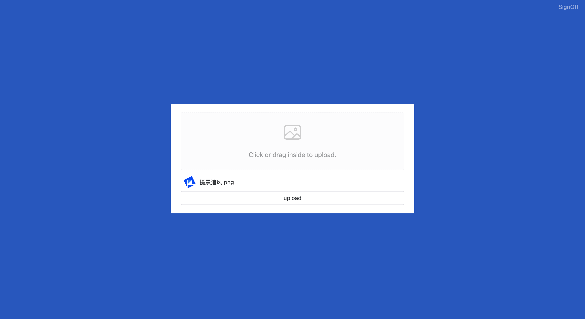

# imageur

Image pool management site

## Screenshots




## Install

Docker is the only way to install imageur. (Or you can run dev mode :p)

> Only Aliyun OSS is supported now. If you want to add more, raise an issue :P.

### Setup Aliyun-OSS service

[Create Bucket](https://help.aliyun.com/document_detail/31842.html)

- Login to [OSS console](https://oss.console.aliyun.com/)
- Click **Bucket List**, click **Create Bucket**
- Fill in the parameters. `Public read` is required
- Create Bucket

[Setup CORS](https://help.aliyun.com/document_detail/31903.htm)

- Login to [OSS console](https://oss.console.aliyun.com/)
- Click **Bucket List**, click you Bucket for imageur
- Click **Access Control > CORS**
- Click **Configure** in CORS section
- Click **Create Rule**

```txt
Soures:
  you exact domain
  e.g. www.aliyun.com or *.aliyun.com
Allowed Methods:
  Check all
Allowed Headers:
  *
Exposed Headers:
  ETag
  x-oss-request-id
  x-oss-version-id
```

### Setup Aliyun STS service

[Follow this document first](https://help.aliyun.com/document_detail/100624.htm)

YOU NEED TO CHANGE **POLICY DOCUMENT** TO THE FOLLOWING

```json
{
  "Version": "1",
  "Statement": [
    {
      "Effect": "Allow",
      "Action": "oss:PutObject",
      "Resource": [
        "acs:oss:*:*:YOUR_BUCKET_NAME/share",
        "acs:oss:*:*:YOUR_BUCKET_NAME/share/*"
      ]
    }
  ]
}
```

You need to get the following field in this step:

- `AccessKey ID`
- `AccessKey Secret` (only show once, be sure to store it some where)
- `ARN`

### Environment

```yml
- USERNAME: admin
- PASSWORD: admin
- SECRET: random string
- ACCESS_KEY_ID: Aliyun AccessKey ID
- ACCESS_KEY_SECRET: Aliyun AccessKey Secret
- ARN: OSS ARN
- REGION: OSS Region e.g. oss-cn-beijing
- BUCKET: OSS Bucket name
```

### Start docker

Copy the `docker-compose.yml`, config environment and run `docker-compose up` to test.

If all works fine, `Ctrl C` to shutdown then run `docker-compose up -d` to deploy.
